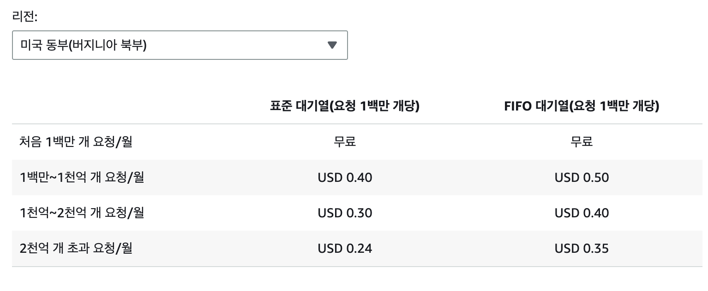
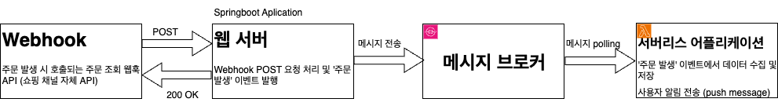

- #TroubleShooting #aws
-
- ### I. 프로젝트 셋업
	- AWS SQS
	  logseq.order-list-type:: number
		- 
		- AWS의 완전 관리형 메시지 대기열.
			- -> pub/sub 기반 이벤트 중심 아키텍처에서 생산자와 소비자를 연결하는 브로커의 역할.
				- 생산자: 이벤트가 생성되면 SQS 대기열에 메시지를 전송
				- 소비자: SQS 대기열에서 메시지를 폴링(소비)해 처리
			- SQS는 대기열을 동적으로 확장/축소하여 메시지 작업 완료 여부와 순서를 보장
		- 요금 정보 
	- Springboot 환경에서 AWS SQS 메시지 브로커 구현
	  logseq.order-list-type:: number
		- AWS는 SQS와 Springboot 프로그램의 연동을 위해 Java SDK를 제공함
			- 생성자에서 사용가능한 함수: SendMessage(SendMessageRequest sendMessageRequqest), SendMessageBatch(SendMessageBatchRequest sendMessageBatchRequest)
			- 소비자에서 사용가능한 함수: ReceiveMessage(ReceiveMessageRequest receiveMessageRquest)
			- 그 외 함수: CreateQueue, DeleteMessage, DeleteQueue, GetQueueUrl, ListQueues, SetQueueAttributes ...
			- 각 함수는 MessageQueueURL을 바탕으로 큐에 접근함
-
- ### II. 생산자 / 소비자 설계
	- 프로세스 처리 플로우
	  logseq.order-list-type:: number
		- 
		- 구현해야 하는 기능: Shopify 쇼핑몰에서 주문이 발생하면 Webhook POST 요청에서 주문 정보를 추출하고, DB에 저장한다. DB에 정상적으로 주문이 저장되면, 어플리케이션 사용자(쇼핑몰 사장)에게 주문이 발생했다는 푸시 메시지를 전송한다.
		- SQS 도입 포인트: 외부 쇼핑몰에서 주문이 발생하는 플로우와 어플리케이션 사용자가 주문을 확인하고 처리하는 플로우는 서로 다른 서비스 시스템에서 발생하므로, 유지보수의 용이성과 서버 성능을 고려하여 분리한다. 이 때, 각 서버의 요소는 메시지 형태로 통신하며, 각 메시지는 AWS SQS를 통해 전달된다.
	- 생산자
	  logseq.order-list-type:: number
		- 웹훅 API 요청이 발생하면 200 OK 응답을 전송하고 주문 발생 메시지를 발행해 SQS에 전송한다.
			- 200 OK: Shopify에서 웹훅을 중복 전송하지 않도록 SQS 메시지를 발행한 즉시 응답을 전송한다. 파싱 결과에 관계 없이 응답을 전송하므로 API 응답 속도는 향상된다.
			- 메시지: Shopify 주문 조회 페이로드에 해당하는 데이터
			- 생산자의 역할은 주문 발생을 탐지하고(웹훅 API) 주문 발행 정보를 SQS에 전달하는 것으로 종료된다.
		- 웹훅 요청 Endpoint가 필요하므로, 기존 API Endpoint가 위치한 웹 서버 상에 구현한다.
			- 웹훅 요청은 즉시 200 OK를 전송하고 종료되므로 기존 클라이언트 API 요청에 끼치는 영향은 미미하다.
	- 소비자
	  logseq.order-list-type:: number
		- SQS에서 주문 발행 메시지를 polling한다.
		- 메시지에서 Shopify 주문 내역을 확인하고, 필요한 내용을 파싱해 DB 저장한다.
		- 어플리케이션 사용자에게 푸시 메시지를 전송하고 DB에 전송 내역을 업데이트한다.
-
- ### III. AWS Lambda 서버리스 소비자 구현
	- 주문 발생 처리 플로우에서, 소비자의 역할은 생산자와 완벽히 구분되므로 별도의 컴퓨팅 유닛으로 분리했다. 이 때, 주문 발생량이 많지 않은 개발 단계에서는 사용 시간 단위로 과금되는 EC2보다 트리거 횟수 단위로 과금되는 서버리스 Lambda의 비용이 적을 것으로 예측했다.
	- AWS SQS의 AWS Lambda 트리거
		- AWS는 Lambda 트리거 요소로 SQS 메시지 발행을 지원한다. 해당 기능을 활용하면 SQS에 메시지가 삽입되는 즉시 특정 Lamda 함수가 cold start로 실행되도록 설정할 수 있다.
		- Lambda는 RDS와 같은 VPC에 연결돼, 외부 인터넷 트래픽을 통과하지 않고 DB에 데이터를 삽입할 수 있다.
	- Step Functions 기반의 AWS Lambda 함수 합성
		- 소비자는 현재 데이터 파싱 및 DB 저장 / 푸시 메시지 전송 총 두 가지 역할을 수행한다. 하지만, 두 과정이 항상 동일한 순서(데이터 파싱 -> 푸시 메시지 전송)로 발생되어야 하므로, 완전히 분리하지 않고 함수 합성을 활용해 구현했다.
		- Lambda 함수 호출 순서
			- SQS에 메시지 수신 -> Lambda 트리거 (메시지 소비)
			- 첫 번째 함수: JSON 데이터에서 주문 관련 데이터를 파싱하고, DB에 저장
				- 성공: 두 번째 함수 트리거
				- 실패: 워크 플로우 종료
			- 두 번째 함수: Firebase Cloud Message 활용해 푸시 메시지 전송
				- 성공: 워크 플로우 종료
				- 실패: 워크 플로우 종료
		- JSON 파싱에 실패하거나 DB 저장에 실패했다는 것은 JSON의 값이 유효하지 않거나 기존 DB의 데이터와 정합하지 않다는 의미이므로, 해당 메시지 처리를 포기한다.
-
- ### IV. 도입 결과
	- 강도 테스트 [[API 호출 강도 테스트 (어설픔)]] 결과 요약
	  logseq.order-list-type:: number
		- 개선 전
			- 주문 발생 워크플로우가 기존 REST API 서버에서 수행돼 API 요청이 증가하면 서로 자원을 두고 경쟁하며 서버 성능을 크게 감소시켰다.
		- 개선 후
			- 클라이언트가 호출하는 REST API 서버와 웹훅 API가 호출하는 서버리스 Lambda가 별개의 프로세스에서 작동해 결합도가 감소했다.
			- 그 결과로, 두 요청의 트래픽을 Tomcat 연결 풀보다 크게 증가시켜도 트래픽이 적을 때와 비슷한 수준의 응답 속도를 유지했다.
	- 추가 개선 및 리팩토링 방향
	  logseq.order-list-type:: number
		- RabbitMQ 도입
			- 현재 서버 구조에서는 MSA 서버 간 인터페이스가 REST API로 이루어져 있어 비동기 서버 처리의 이점을 살리지 못하고 있음
				- 클라이언트 요청에 두 서버 모두 필요한 경우, 모든 서버 호출이 종료되기 전까지 응답을 전송하는 것이 불가능
				- 외부 요인으로 API 처리 실패 시 재처리(내결함성)를 위해 try-catch문이 여러번 필요함
			- AMQP를 직접 구현하는 RabbitMQ 기반 이벤트 중심 아키텍처로 리팩토링 진행하여 서버간 결합을 더욱 느슨하게 분리하고, 통신 속도는 향상시킬 수 있을 것으로 기대된다.
		- 대량의 트래픽을 처리해야 하는 경우에는 SQS와 같은 이벤트 방식이 효율적이고, 코드의 응집도도 낮출 수 있는 방법이었다. 하지만 트래픽이 크지 않은 소형 서비스의 경우는 어떨까? 어느 임계부터 이벤트 중심 아키텍처의 효용이 있다고 말할 수 있을까?
-
- ### 출처
	- AWS 공식 사이트 https://aws.amazon.com/ko/sqs/
	- AWS SDK for Java Documentation https://docs.aws.amazon.com/sdk-for-java/
-
- ### 수정 내역
	- [[Jul 23rd, 2025]] 최초 발행
	  logseq.order-list-type:: number